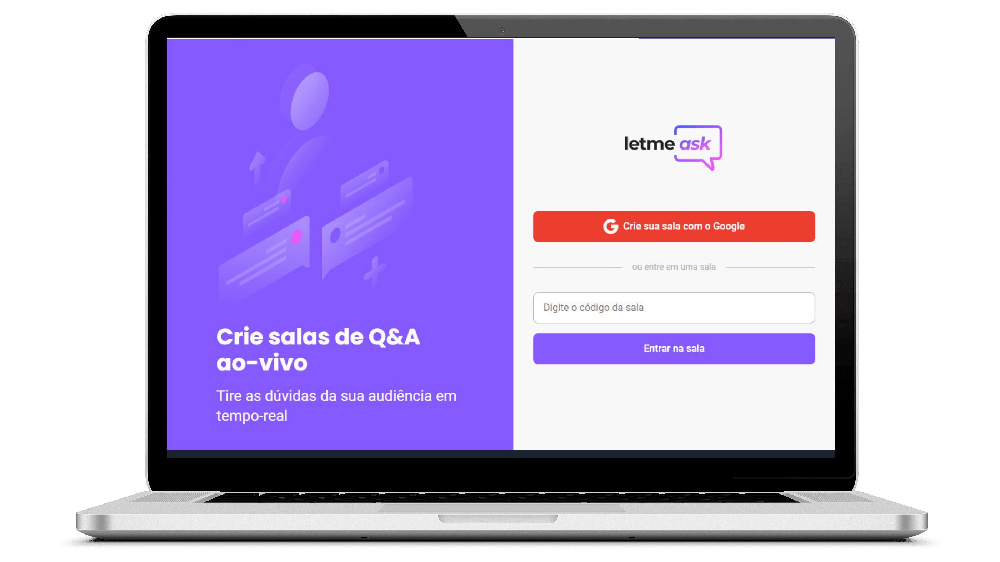
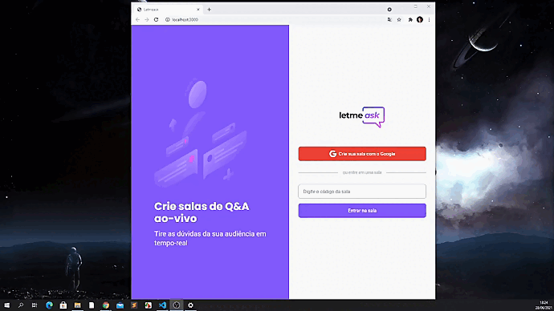
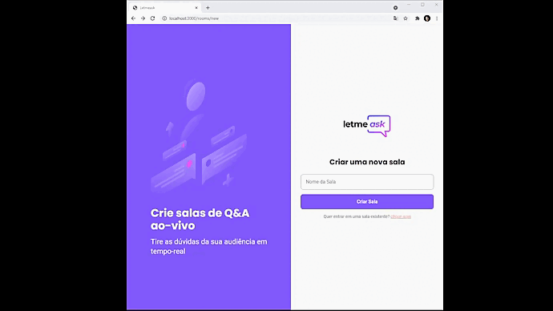
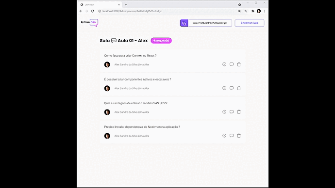
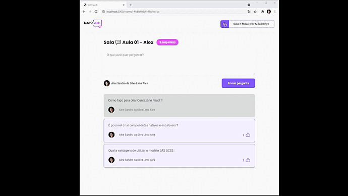

<!---------- Title/ Logo -------------->
<h1 align="center">
            
  <!--//width="220px" /-->
</h1>

<!-- ------- Ancoras --------------->
<p align="center">
  <a href="#-sobre">Sobre</a>&nbsp;&nbsp;&nbsp;|&nbsp;&nbsp;&nbsp;
  <a href="#-projeto">Projeto</a>&nbsp;&nbsp;&nbsp;|&nbsp;&nbsp;&nbsp;
  <a href="#-telas">Telas</a>&nbsp;&nbsp;&nbsp;|&nbsp;&nbsp;&nbsp;
  <a href="#-tecnologias">Tecnologias</a>&nbsp;&nbsp;&nbsp;|&nbsp;&nbsp;&nbsp;
  <a href="#-licença">Licença</a>
</p>

<!---------- Badges ----------------->  
<div align="center">

  
  
  
  
  
   <!-- 
  
  
   -->
  <!----(4953b8)--BlueDark -->
  <!----(49AA26)--Green -->
  <!----(008ed6)--Blue -->
  <!----(3292a6)--BlueMedium-->
  <!----(6E40C9)--Bluepurple-->
</div>
<div align="center">

  
  
  
  

</div>
<br>
  
<!---------- showcase  ----------------->  
<p align="center">
  
</p>

 <!----- Acess Deploy Demonstration-->
 <!-- <h5 align="center">
    🎬 Clique Aqui: &nbsp; <a href="https://podcastr-alxlima.vercel.app/">  Visualizar Demonstração </a> 
 </h5> -->


<!----- Description ------------------>
## 🔖 Sobre

&nbsp;&nbsp;&nbsp;&nbsp;Este projeto é parte do evento que participei o **Next Level Week #6** conhecido como **NLW** da [Rocketseat](https://rocketseat.com.br). &nbsp;&nbsp;Foi uma semana de maratona de estudos sobre desenvolvimento Web(Front-End), em sua 6° edição. 
 
 &nbsp;&nbsp;&nbsp;&nbsp;O projeto denominado **letmeAsk**, teve como objetivo criar uma aplicação que possibilita a integração de usuários se comunicarem em tempo real, criando salas de conversas on-line, e compartilhar perguntas e respostas sobre temas de duvidas em questão. &nbsp;&nbsp; Cada usuário poderá se conectar através de sua conta pessoal Google, tendo ações de criar uma nova sala, curtir as repostas dos outros usuário e como administrador terá as permissões de excluir e confirmar as mesmas.
  
  <br>

  ## 💻 Projeto

  &nbsp;&nbsp;&nbsp;&nbsp;A Construção e desenvolvimento foi através de arquitetura de componentes do **React.js** e **Firebase**, utilizando dependências de serviços de autenticação usuários Google, tendo acesso a base de dados "Real-Time",  **TypeScript**, aplicando conceitos de utilização de componentes aplicados a contextos, que tem a vantagens de poder ser consumidos em requisições clientes **API**, utilização de servidor **Firebase.Json** que projeta recursos de atualização de processamentos de dados na aplicação, sobre execução de mensagens, como endereçamento de rodas foi utilizando a biblioteca **react-router-dom** para requisições Http. 
  
  &nbsp;&nbsp;&nbsp;&nbsp; Como arquitetura de desenvolvimento foi aplicado o conceito de **Hooks, Contexts, Conponentes**, e criado arquivo **.env.Local** de configurações conexão **firebase.json**, incluindo boas praticas de tipagens e formatação de layout incluindo **SAS - CSS**.


<br>

 ###### **Evento :** Maratona -NLW 6ª Edição - [Rocketseat](https://rocketseat.com.br)
 ###### **Instrutor :** Diego Fernandes
<br>

<!----- Showcase Screens Shot------------------>
## 💻 **Telas**

<div align="center">
  
  
  
  
</div>
<br>
<br>


## 🚀 Tecnologias

- [HTML5](https://pt.wikipedia.org/wiki/HTML5) - Hyper Text Markup Language - linguagem de marcação de hipertexto.
- [SAS-CSS](https://sass-lang.com/) - Cascading Style Sheets - Estilização de código html.
- [React](https://reactjs.org/) - Biblioteca JavaScript para criação de Interfaces (Front-End)
- [Firebase](https://firebase.google.com/?hl=pt) - Realtime Database, plataforma de desenvolvimento de aplicativos móveis do Google.
- [TypeScript](https://www.typescriptlang.org/) - Conjunto da linguagem JavaScript com definições de tipo estático.
- [Node.js](https://nodejs.org/en/) - Ambiente de execução Javascript server-side.
- [JSON](https://www.json.org/json-en.html) - JavaScript Object Notation - Tranferencia de dados cliente servidor.
- [VS Code](https://code.visualstudio.com/) - Editor de desenvolvimento de aplicações web.

<br>

<!----- Configurations ---------------------------->
## 📌 Instruções : 

&nbsp;&nbsp;&nbsp;&nbsp; Para configurar o Serviço API - Firebase.json, deve acessar seu proejeto através do console da plataforma e incluir regas de **RealTime Database**, acessando: **Realtime Database/ Regras /Editar Regras**, e incluir as permissões de conexão de banco de dados do firebase, enfim na box com o JSON de regras copie e cole o seguinte codigo abaixo, que poderam ser sincronizados no projeto no arquivo: **_database.rules.json_**.
```bash
  # Configuração de Regras - Realtime Database
  {
  "rules": {
    "rooms": {
      ".read": false,
      ".write": "auth != null",
      "$roomId": {
        ".read": true,
        ".write": "auth != null && (!data.exists() || data.child('authorId').val() == auth.id)",
        "questions": {
          ".read": true,
          ".write": "auth != null && (!data.exists() || data.parent().child('authorId').val() == auth.id)",
          "likes": {
            ".read": true,
            ".write": "auth != null && (!data.exists() || data.child('authorId').val() == auth.id)"  
          }
        }
      }
    }
  }
}

```
>**_Observação_**:  Ajustar as conexões com API- FireBase.js nas configurações do arquivo: **.env.Local**,  incluindo os parâmetros de informações acessando: **Configurações do projeto/seus aplicativos/Web App/Configuração do SDK**, selecionando a opção que contem Objeto: **_const firebaseConfig_** de configuração do Firebase que contém as chaves e identificadores do seu app.

&nbsp;&nbsp;&nbsp;&nbsp;Para iniciar o Servidor da aplicação use o comando: **_npm start_** então acesse pelo navegador **_http://localhost:3000/_** 


<br>


## 📝 Licença
<a href="https://opensource.org/licenses/MIT">
    
</a>

 &nbsp;&nbsp;&nbsp;&nbsp;Esse projeto está sob a licença MIT. Veja o arquivo [LICENSE](https://opensource.org/licenses/MIT) para mais detalhes.

 <br>

## 📁 Como Baixar o Projeto

```bash
  # Clonar o repósitorio
  $ git clone https://github.com/alxlima/LetmeAsk
  
  # Entrar no diretório
  $ cd c:/nlw/LetmeAsk

  # Instalar as dependências
  $ npm install
  
  # Iniciar o Projeto
  $ npm start

```
#
 Desenvolvido 🚀 por: ***_Alex Sandro da Silva lima_***


[](https://www.linkedin.com/in/alex-sandro-da-silva-lima-8b297839/) &nbsp;&nbsp;
[](mailto:alex_lima2013@hotmail.com)&nbsp;&nbsp;
[](https://join.skype.com/invite/qVJuRbOrbqKG)&nbsp;&nbsp;
[](https://github.com/alxlima)

